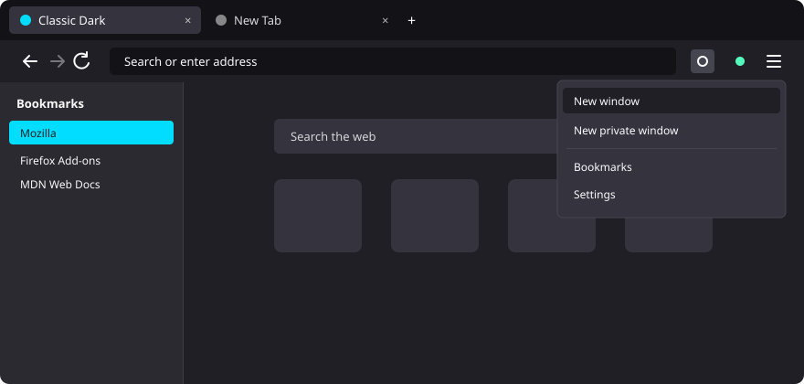
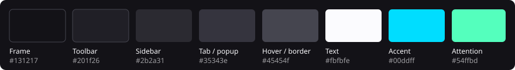

# Classic Dark

**A calm, deep-dark Firefox theme that brings back the look of the classic Proton design: solid, neutral colors with no gradients, no images and no purple tint.**



Every surface is a single solid color, and the theme sets all of Firefox's theme color keys, so nothing falls back to the Nova defaults. Menus, settings pages and the new tab page follow dark mode too.

## Palette



| Role | Color |
|---|---|
| Tab bar, address bar | `#131217` |
| Toolbar, new tab page, menu highlight | `#201f26` |
| Sidebar | `#2b2a31` |
| Selected tab, popups, focused address bar, new tab cards | `#35343e` |
| Button hover, popup border, separators | `#45454f` |
| Button pressed | `#4f4f59` |
| Text and icons | `#fbfbfe` |
| Focus ring, loading indicator, sidebar selection | `#00ddff` |
| Attention icon | `#54ffbd` |
| Selected text in address bar | `#2e7082` |

## Install

### [⬇ Install Classic Dark](https://github.com/Endre-Tonnessen/Firefox-classic-dark-theme/releases/latest/download/classic-dark.xpi)

Open the link above in Firefox. It always downloads the latest signed version. Then click the downloaded file to install it, and pick **Classic Dark** under **Themes** in `about:addons`. Older versions are on the [releases page](https://github.com/Endre-Tonnessen/Firefox-classic-dark-theme/releases).

## Test it temporarily

1. Open `about:debugging` in Firefox.
2. Click **This Firefox**.
3. Click **Load Temporary Add-on…** and select `manifest.json` in this folder (or the `classic-dark-theme.zip` file).

The theme stays active until Firefox restarts.

## Get it signed for permanent use

Release Firefox only installs signed add-ons permanently. To sign it for your own use without listing it publicly:

1. Go to [addons.mozilla.org/developers](https://addons.mozilla.org/developers/) and sign in.
2. Choose **Submit a New Add-on**.
3. When asked how to distribute it, pick **On your own** (unlisted / self-distributed).
4. Upload `classic-dark-theme.zip` (it has `manifest.json` at its root).
5. Once validation and signing finish, download the signed `.xpi` and open it in Firefox (drag it into a window, or use *Install Add-on From File…* in `about:addons`).

## Publishing an update

Everything is managed from the **[AMO Developer Hub](https://addons.mozilla.org/en-US/developers/)** (your add-ons are under [My Add-ons](https://addons.mozilla.org/en-US/developers/addons)).

1. Bump `version` in `manifest.json` (every upload needs a new version number) and rebuild `classic-dark-theme.zip`.
2. In the Developer Hub, open **Classic Dark → Upload New Version** and upload the zip.
3. When it's signed, right-click the `.xpi` link and choose **Save Link As…** (left-clicking installs it instead).
4. Rename it to `classic-dark.xpi` (keep this name so the install link always works) and attach it to a GitHub release:
   ```
   gh release create v<version> classic-dark.xpi --title "Classic Dark <version>" --notes "..."
   ```

## License

Released into the public domain under [The Unlicense](LICENSE). Use it however you like.
